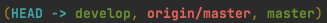
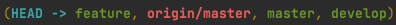

Этапы 1-4:

1. Создать репозиторий с веткой master.
2. Создать на http://bitbucket.org/ или github если нет свой аккаунт, добавить репозиторий и подключить email менторов.
3. Локально в ветке master создать файл index.php который будет содержать:
<?php echo ‘Hello world’;?>
4. Запушить изменения.

#### git init
#### git add .
#### gh repo create
#### git commit -m "first commit of index.php to branch master"
#### git push origin master 

#### git branch develop 

#### git checkout develop   

#### git checkout -b feature 

